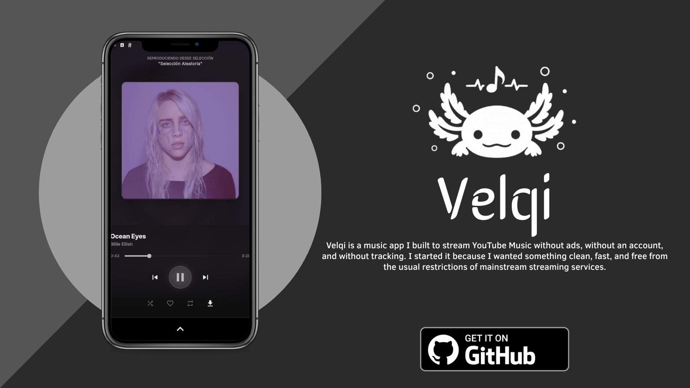

# Velqi

---

## Español

Velqi es una app de música que hice para escuchar YouTube Music sin anuncios, sin cuenta y sin rastreo.

### Descarga

### Funciones

- Sin anuncios, nunca.
- Sin cuenta requerida.
- Letras sincronizadas (LRCLIB) y modo letra plana.
- Tema dinámico que se adapta al álbum que suenas.
- Caché automático de canciones.
- Descarga offline.
- Reproductor en segundo plano con controles en la notificación.
- Radio automática desde cualquier canción, artista o álbum.
- Temporizador de sueño.
- Salto de silencio.
- Gestión de biblioteca: playlists, favoritos, artistas, álbumes.
- Importar desde YouTube compartiendo un link directo a la app.
- Control de calidad de stream.
- Soporte de cookies de YouTube para contenido restringido por región.

### ¿Por qué solo Android?

Decidí lanzar primero la versión de Android porque la versión de escritorio (Windows/Linux) todavía tiene varios bugs que no me convencen para publicarla. Prefiero esperar a tenerla estable antes de sacarla.

En cuanto a iOS, un port es técnicamente muy complicado: iOS no permite ejecutar intérpretes de Python embebidos ni servidores HTTP locales dentro de la app, que es exactamente la arquitectura que usa Velqi para funcionar. No es algo que se pueda solucionar fácilmente sin reescribir toda la capa de backend.

### Traducciones

Velqi soporta 50 idiomas. Si quieres ayudar a mejorar o agregar una traducción, edita los archivos en la carpeta [`localization/`](localization/).

`Árabe` `Azerbaiyano` `Bengalí` `Búlgaro` `Birmano` `Catalán` `Checo` `Chino (Simplificado)` `Chino (Tradicional)` `Coreano` `Croata` `Eslovaco` `Español` `Esperanto` `Estonio` `Euskera` `Fiyiano` `Filipino` `Finlandés` `Francés` `Gaélico` `Gallego` `Alemán` `Hindi` `Holandés` `Húngaro` `Indonesio` `Inglés` `Interlengua` `Irlandés` `Italiano` `Japonés` `Kannada` `Jemer` `Kurdo` `Malayalam` `Noruego` `Oriya` `Persa` `Polaco` `Portugués` `Punjabi` `Rumano` `Ruso` `Serbio` `Sueco` `Tamil` `Telugu` `Turco` `Ucraniano` `Urdu` `Vietnamita`

### Solución de problemas

**Pantalla de carga larga al primer arranque:**
Es normal. El primer inicio inicializa el motor de audio embebido (~15–30s según el dispositivo). Los arranques siguientes son casi instantáneos.

**El contenido no carga:**
Verifica tu conexión a internet. Para contenido restringido por región, puedes agregar tus cookies de YouTube en **Ajustes → Avanzado → Cookies de YouTube**.

### Licencia

Velqi es software libre bajo la licencia **GNU GPL v3.0**:
- Las versiones modificadas deben seguir siendo libres y de código abierto.
- No puede publicarse en tiendas de código cerrado (Google Play, App Store, etc.).
- No puede usarse con fines comerciales sin permiso explícito.

### Descargo de responsabilidad

Este proyecto es de uso personal y educativo. No tengo ninguna afiliación con YouTube ni Google. Todo el contenido al que se accede a través de Velqi pertenece a sus respectivos propietarios. El software se provee "tal cual", sin garantía de ningún tipo.

---

## English

Velqi is a music app I built to stream YouTube Music without ads, without an account, and without tracking. I started it because I wanted something clean, fast, and free from the usual restrictions of mainstream streaming services.

### Download

### Features

- No ads, ever.
- No account required.
- Synced lyrics (LRCLIB) and plain text mode.
- Dynamic theme that adapts to the current album art.
- Automatic song caching.
- Offline downloads.
- Background playback with notification controls.
- Crossfade between tracks.
- Built-in equalizer.
- Auto radio from any song, artist or album.
- Sleep timer.
- Silence skipping.
- Library management: playlists, bookmarks, artists, albums.
- Import from YouTube by sharing a link directly into the app.
- Streaming quality control.
- YouTube cookies support for region-restricted content.

### Why Android only?

I'm releasing Android first because the desktop version (Windows/Linux) still has several bugs I'm not comfortable shipping. I'd rather wait until it's solid before putting it out.

As for iOS — a port is technically very difficult. iOS doesn't allow running embedded Python interpreters or local HTTP servers inside app processes, which is exactly how Velqi's backend works. It's not something that can be easily fixed without rewriting the entire backend layer.

### Translation

Velqi supports 50 languages. If you'd like to help improve or add a translation, edit the files in the [`localization/`](localization/) folder.

`Arabic` `Azerbaijani` `Bengali` `Bulgarian` `Burmese` `Catalan` `Chinese (Simplified)` `Chinese (Traditional)` `Croatian` `Czech` `Dutch` `English` `Esperanto` `Estonian` `Basque` `Fijian` `Filipino` `Finnish` `French` `Galician` `German` `Hindi` `Hungarian` `Indonesian` `Interlingua` `Irish` `Italian` `Japanese` `Kannada` `Khmer` `Korean` `Kurdish` `Malayalam` `Norwegian` `Oriya` `Persian` `Polish` `Portuguese` `Punjabi` `Romanian` `Russian` `Serbian` `Slovak` `Spanish` `Swedish` `Tamil` `Telugu` `Turkish` `Ukrainian` `Urdu` `Vietnamese`

### Troubleshooting

**Playback stops when the screen turns off:**
Go to your device's battery settings and set Velqi to **Unrestricted**, or enable "Ignore Battery Optimizations" from within the app settings.

**Long loading screen on first launch:**
Normal. The first launch initialises the embedded audio engine (~15–30s depending on your device). Subsequent launches are near-instant.

**Content not loading:**
Check your internet connection. For region-restricted content, add your YouTube cookies via **Settings → Advanced → YouTube Cookies**.

### License

Velqi is free software under the **GNU GPL v3.0**:
- Modified versions must remain free and open-source.
- Cannot be published on closed-source stores (Google Play, App Store, etc.).
- Cannot be used commercially without explicit permission.

### Disclaimer

This is a personal and educational project. I have no affiliation with YouTube or Google. All media accessed through Velqi belongs to its respective rights holders. The software is provided "as-is", without warranty of any kind.
